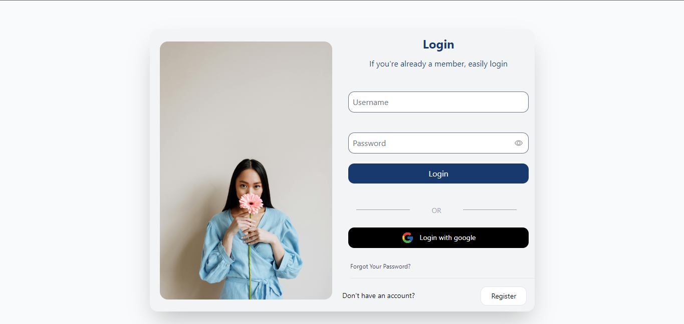
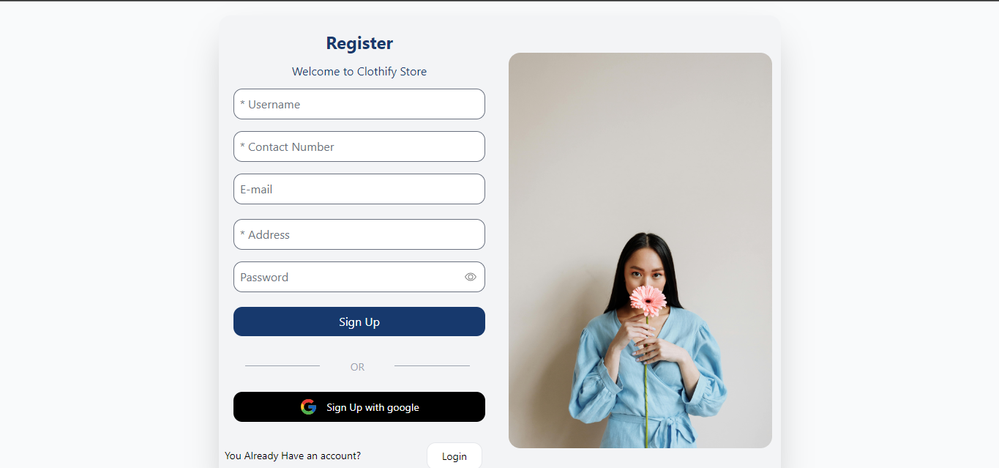

# E-commerce Frontend

### Table of Contents

- [Introduction](#introduction)

## INTRODUCTION

Welcome to the frontend design of our E-Commerce application. This application is built using modern web technologies, ensuring a seamless and responsive user experience. Below is a brief introduction to the design components:

## Home Page

The home page features a clean and modern design with a focus on showcasing our latest collection. The header includes navigation links for easy access to different sections of the site.


## Login Page

The login page is designed to be simple and user-friendly. It allows users to log in with their username and password, or use the Google login option for convenience.



## Registration Page

The registration page enables new users to sign up by providing essential information using validation. The design ensures that the form is straightforward and easy to complete.



## Features

- **Responsive Design**: Ensures the application looks great on all devices.
- **User Authentication**: Secure login and registration options.
- **Modern UI**: Utilizes the latest design trends to provide an appealing user experience.
- **Easy Navigation**: Intuitive navigation to enhance user engagement.

## Technologies Used

- **React**: For building the user interface.
- **Tailwind CSS**: For utility-first CSS styling, responsive and mobile-first design.
- **Axios**: For get data from servers.

We hope you enjoy the experience of using our E-Commerce application. If you have any feedback or suggestions, feel free to reach out to me.

## Installation
Follow these steps to clone and run the project locally.

### Prerequisites
Ensure you have the following installed:
- [Node.js](https://nodejs.org/) (which includes npm)
- [Git](https://git-scm.com/)

### Steps
1. **Clone the repository:**
   ```bash
   
   git clone https://github.com/Hansajaa/E-Commerce-Front-End.git

2. **Navigate to the project directory:**
    ```bash
    cd e-commerce-frontend
    
3. **Install dependencies:**
    ```bash
    npm i
    
4. **Run the development server:**
   ```bash
   npm run dev
   
5. **Open your browser and visit:**
   ```bash
   http://localhost:5173


